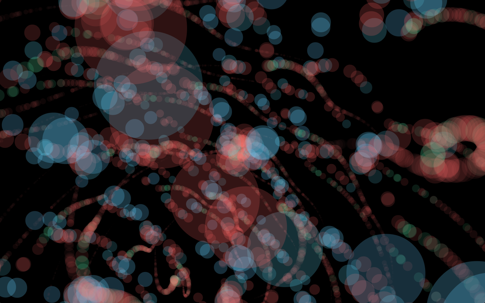

# Live Audio Visualizer (browser-based and interactive) #

Try it out live here (Chrome or Firefox): https://elliottwobler.github.io/live-audio-visualizer-web-app/

## Overview ##

This web application visualizes sonic events in real time using a combination of the device's default microphone input, the [Web Audio API](https://developer.mozilla.org/en-US/docs/Web/API/Web_Audio_API), and the [three.js](https://threejs.org) JavaScript graphics library. It currently requires Google Chrome or Mozilla Firefox. It has been tested on Chrome Beta for Android but is not compatible with Safari or iOS (i.e. any browser apps on iPhones, iPads, etc.) due to their lack of support for the `getUserMedia` function ([this should change with Safari 11](https://webkit.org/blog/7726/announcing-webrtc-and-media-capture/)). Upon loading, the app displays a black canvas and - using the previously mentioned function - prompts the user to allow sample data access from their device's default microphone. As soon as permission is granted, visualization of live audio should begin. 

## Description / Controls ##

Pitch is mapped to the Hue value in HSL format which controls particle color. Amplitude controls the Saturation, Lightness, and opacity/transparency values, particle size, particle displacement/movement, and the entire system's rotation in three-dimensional space. Manual rotation is also enabled via click/touch and drag. Any keyboard or touch event will toggle between the two different VibeLens modes - one where a new scene is created for every frame, and one where a new scene is created after a user-specified duration of frames (effectively displaying the history of sound/particle variation within that time). The length of this duration can be changed instantaneously by moving the mouse/touch along the page's X-axis (increasing in duration from left to right). Run this in full screen for the best effect.

## Notes / Inspiration ##

In Matthew Neil Bain's paper entitled ["Real Time Music Visualization: A Study in the Visual Extension of Music"](http://accad.osu.edu/assets/files/InterfaceLab/MBain_ThesisPaper.pdf), he relates music visualization to the psychological condition of synaesthesia, describing how relevant artists "[break] down sense perception into discrete units, whereby one sensation finds its equivalent in another." He proposes that "music, with its notes and phrases, harmony, and compositional structures, lends itself most readily to visual form, color, space, and motion."

### Here's some screenshots: ###

